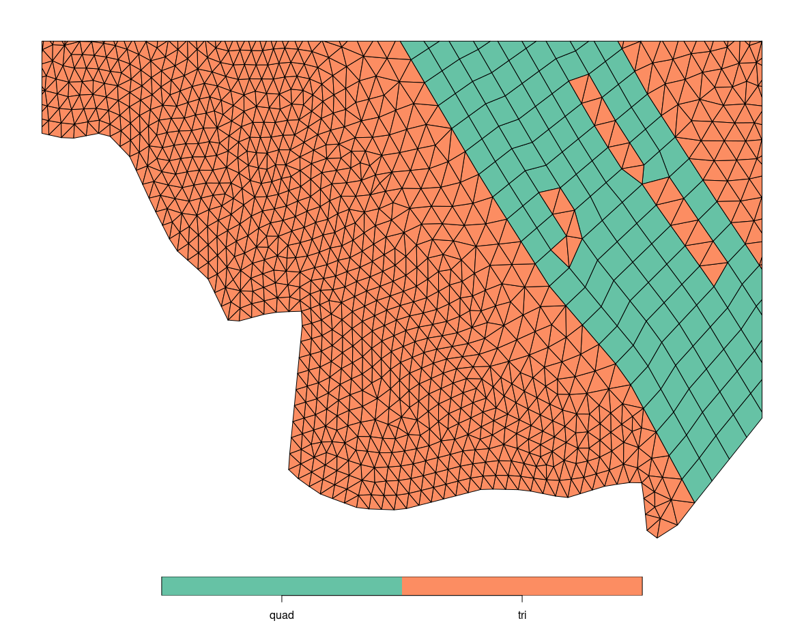
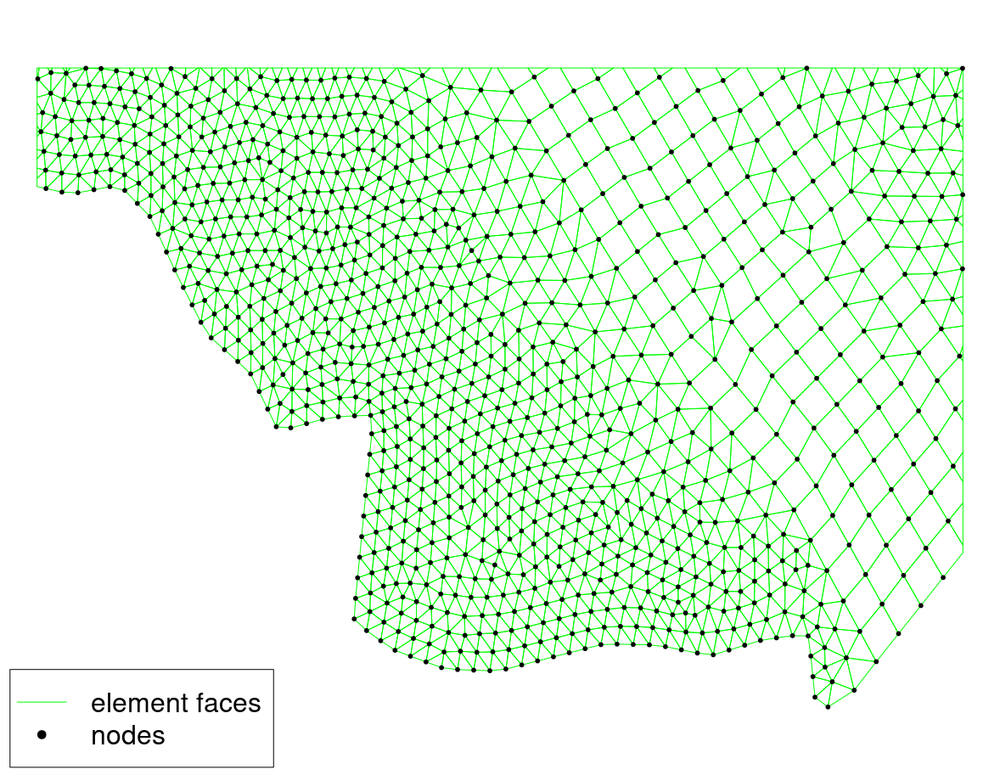
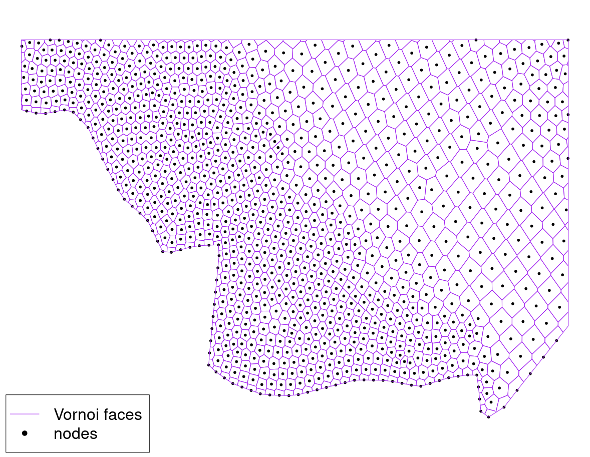

# SCHISM Grid Utils: tools for SCHISM plots

### Main objectives:
1. Generate geo-referenced shapefiles (or kml) for any SCHISM grid using a 2DM mesh file[^1]
2. Draw simple visualizations (using output from 1) of SCHISM output in R and Python.

[^1]: see [grd2sms.pl](https://github.com/schism-dev/schism/blob/7981f18845c94ed7ebb4bda72df5784c677f8353/src/Utility/SMS/grd2sms.pl#L17) for converting gr3 to 2dm


### Contents:
- `geospatial_create.R`
    - main utility for generating the spatial objects (nodes, elements and Voronoi polygons)
    - requires: sf;  install with `install.packages('sf')`
- sample files
    - `deb.2dm`: sample mesh (low-res Delaware Bay)
    - `schout_deb.nc`: sample SCHISM output on DEB grid
- sample plotting scripts:
    - `plot_var.py`  (requires: matplotlib, geopandas, numpy and netCDF4)
    - `plot_var.R`   (requires: sf)
- spatial_files/ 
- figs/


### Basic Usage:
1. configure `geospatial_create.R` 
    - specify 2dm filename
    - preferred output format (KML or shapefile)
    - projection information
2. run `geospatial_create.R`
3. use `plot_var.py` or `plot_var.R` as a template to draw plots

---
See also:\
[SCHISM github](https://github.com/schism-dev/schism) for more info about SCHISM. \
[pySCHISM github](https://github.com/schism-dev/pyschism) for comprehensive python utilities and specifically their [section on visualization](https://schism-dev.github.io/schism/master/getting-started/visualization.html).


contact: `james.kessler@noaa.gov`

---


#### Some background



A schism grid can consist of tris and quads (above).  Both tris and quads are considered elements (or cells).  Elements are defined by their nodes (below):


However, all the diagnostic variables output by SCHISM are actually represented **on the nodes** so there's not a straightforward way to make a nice plot.  (One _can_ create a pseudocolor plot of the data on the nodes but this isn't very nice to look at---lots of overlapping dots or white space, due to the variable mesh spacing)

Instead we can define the area surrounding each node which is closest to that node. These polygons are identical to the definition of [Voronoi (a.k.a Thiessen) polygons](https://en.wikipedia.org/wiki/Voronoi_diagram). This is effecitvely the physical space that a node represents so it's very well suited for making graphics. The Voronoi polygons for the same grid are shown below.



Once we have the Voronoi polygons (created by `geospatial_create.R`), drawing a plot of a variable (say temperature) is as simple as...

```
Pseudo code
1. read in Voronoi spatial object
2. read in temperature from netCDF
3. associate temperature with Voronoi 
4. plot

```

_Note:_ step 3 is very simple since indexing of spatial objects matches that of the netCDF file.

In practice the actual code doesn't look much more complicated...

```
#python code
nc = netCDF4.Dataset('schout_deb.nc')
Z = nc['depth'][:] 
vor = gpd.read_file('spatial_files/deb_vor.shp')
vor['depth'] = depth
vor.plot('varname', legend=True)
```
---

If for whatever reason, one desires to instead plot on the **native grid** (i.e. on the elements), we can compute a (non-weighted) average of from the nodes that make up the elements. The association of nodes to elements is encoded in the 2DM file of course, but it's also contained in the elements KML or shapefile(see below).  To allow for polymorphism, tris have a 4th node represented as `-99` or missing.  Examples of averaging onto elements are provided in `plot_var.py` and `plot_var.R`

```
> els
Simple feature collection with 27679 features and 4 fields
Geometry type: POLYGON
Dimension:     XY
Bounding box:  xmin: -75.67331 ymin: 38.73119 xmax: -74.69493 ymax: 40.19195
Geodetic CRS:  GCS_unknown
First 10 features:
   id       nodes     depth shape                       geometry
1   1   1,2,34,33 11.184318  quad POLYGON ((-74.7564 40.18749...
2   2   2,3,35,34  8.956542  quad POLYGON ((-74.75475 40.1850...
3   3   3,4,36,35  8.678005  quad POLYGON ((-74.75243 40.1833...
4   7   7,8,40,39  7.755940  quad POLYGON ((-74.74161 40.1794...
5   8   8,9,41,40  7.407967  quad POLYGON ((-74.73903 40.1781...
6   9  9,10,42,41  7.035276  quad POLYGON ((-74.73692 40.1762...
7  10 10,11,43,42  6.746283  quad POLYGON ((-74.73497 40.1740...
8  11 11,12,44,43  6.557132  quad POLYGON ((-74.73306 40.1719...
9  12 12,13,45,44  6.595309  quad POLYGON ((-74.73107 40.1698...
10 13 13,14,46,45  6.885668  quad POLYGON ((-74.72922 40.1676...
...
2334  4  5,37,36,-99  8.745195   tri POLYGON ((-74.74715 40.1811...
2335  5  6,38,37,-99  8.005065   tri POLYGON ((-74.74437 40.1802...
2336  6  7,39,38,-99  8.227419   tri POLYGON ((-74.74161 40.1794...
2337 19 37,53,52,-99  9.087807   tri POLYGON ((-74.74674 40.1813...
2338 20 38,54,53,-99  8.576561   tri POLYGON ((-74.74394 40.1806...
2339 21 39,55,54,-99  8.772866   tri POLYGON ((-74.74115 40.1798...
2340 34 53,21,20,-99  6.784233   tri POLYGON ((-74.74633 40.1816...
2341 35 54,22,21,-99  6.739776   tri POLYGON ((-74.7435 40.18095...
2342 36 55,23,22,-99  7.136792   tri POLYGON ((-74.74069 40.1801...
2343 52 74,78,77,-99 11.360674   tri POLYGON ((-74.82015 40.1283...
```


